# CipherFi: Your AI-Powered Financial Companion

CipherFi is a comprehensive financial platform that combines intelligent news aggregation, real-time portfolio management, and personalized insights to empower informed investment decisions. Built for modern investors who demand speed, accuracy, and intelligence in their financial journey.

## Key Features

### 📰 Smart News Aggregation
- **Comprehensive Coverage**: Aggregates news from 20+ trusted cryptocurrency and financial sources
- **AI-Powered Summaries**: Automatically generates concise, readable summaries of complex financial articles
- **Intelligent Categorization**: Organizes news into 6 key categories (economy, finance, macro, stocks, crypto, commodities) for easy navigation
- **Real-Time Updates**: Fresh content delivered every 30 minutes to keep you ahead of market movements

### 📊 Advanced Portfolio Management
- **Multi-Asset Tracking**: Monitor unlimited stocks, cryptocurrencies, ETFs, and commodities in one unified dashboard
- **Live P&L Calculations**: Real-time profit/loss tracking with automatic currency conversions across 15+ currencies
- **Complete Transaction History**: Detailed buy/sell/dividend/fee tracking with cost basis calculations
- **Performance Analytics**: Daily portfolio snapshots with historical performance tracking and benchmarking

### 📈 Real-Time Market Data
- **Live Quotes**: Instant price updates for 1000+ assets with extended hours support
- **Historical Data**: Flexible timeframe analysis from 1 day to 5 years for comprehensive market research
- **Smart Asset Discovery**: Powerful search functionality to find and track new investment opportunities
- **Global Currency Support**: Automatic exchange rate calculations for international portfolios

### 🔔 Intelligent Alert System
- **Custom Price Alerts**: Set personalized thresholds for price movements with percentage or absolute value triggers
- **News Monitoring**: Get notified about articles containing your chosen keywords or from specific categories
- **Multi-Channel Delivery**: Receive alerts via push notifications and email, with customizable frequency controls
- **Daily Digest**: Automated morning summaries to start your day with key market insights

### 🎓 Educational Content Platform
- **Comprehensive Library**: Access 50+ expertly crafted articles on blockchain technology and trading strategies
- **Structured Learning Paths**: Progressive content from beginner to advanced levels with interactive elements
- **Rich Media Experience**: Enhanced learning with diagrams, examples, and practical applications

### 🔒 Secure & Reliable
- **Advanced Authentication**: Secure login with social options and two-factor authentication support
- **Data Privacy**: Enterprise-grade security with encrypted data storage and transmission
- **Cross-Platform Sync**: Seamless experience across mobile and web with real-time synchronization

## Screenshots

| Home Screen | Market Data | News Feed |
|-------------|-------------|-----------|
| 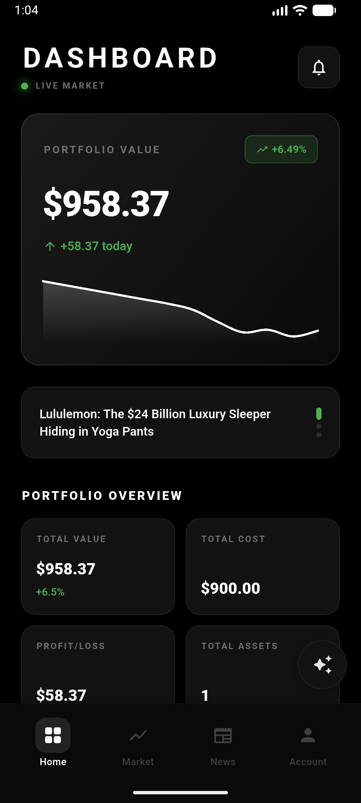 | 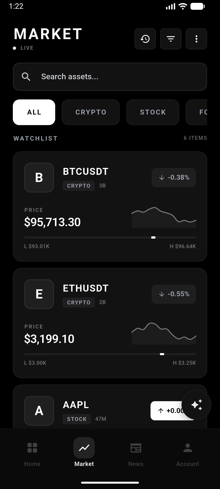 | 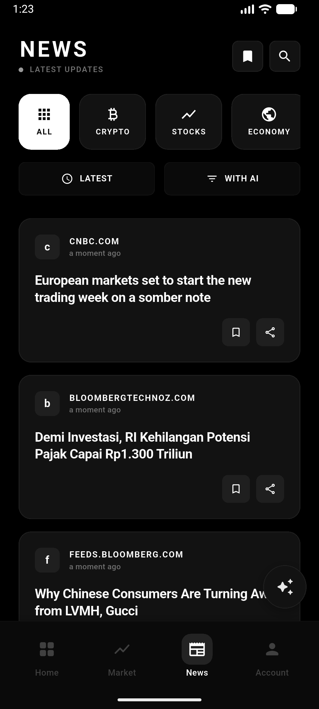 |

| Portfolio Management | Asset Details | News Details |
|----------------------|---------------|--------------|
| 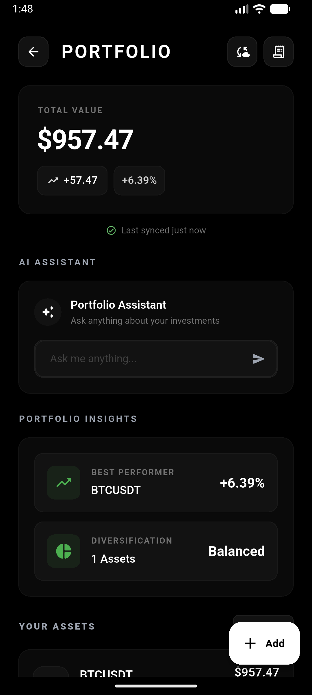 |  |  |

| AI Insights | Appearance Settings | Currency Settings |
|-------------|---------------------|-------------------|
|  | 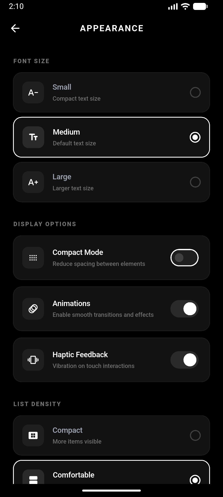 | 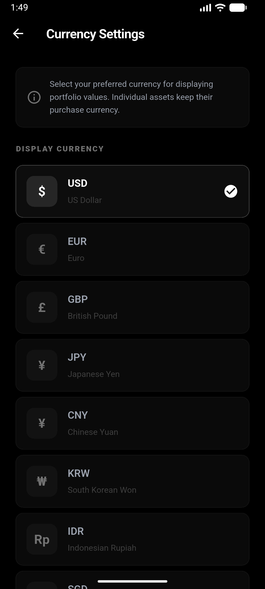 |

| Education Section | Preferences | Profile |
|-------------------|-------------|---------|
| 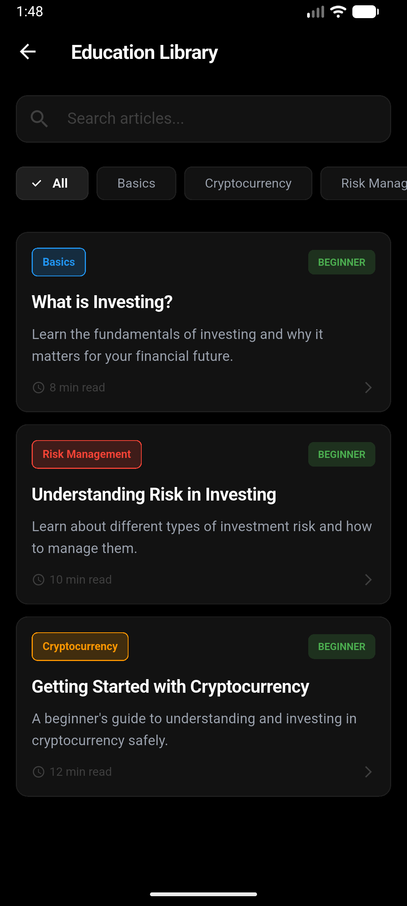 | 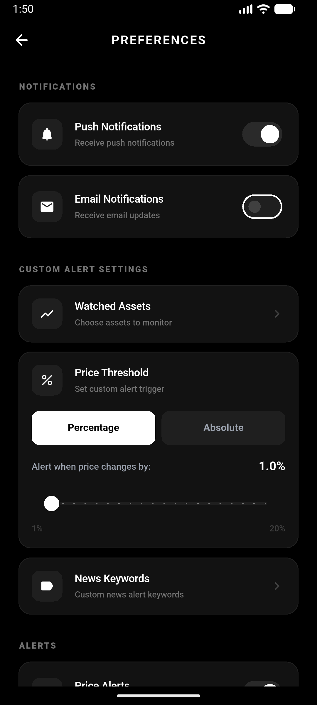 | 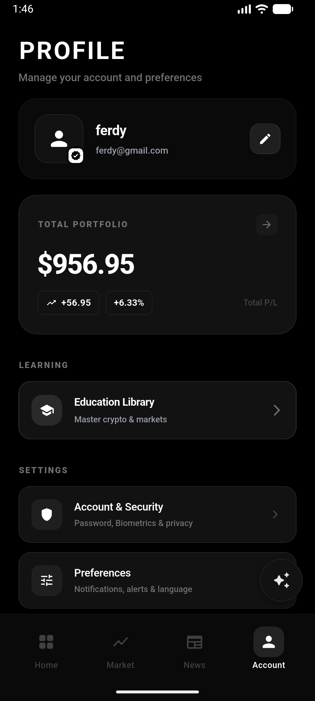 |

| Security Settings | Profile 2 |
|-------------------|-----------|
| 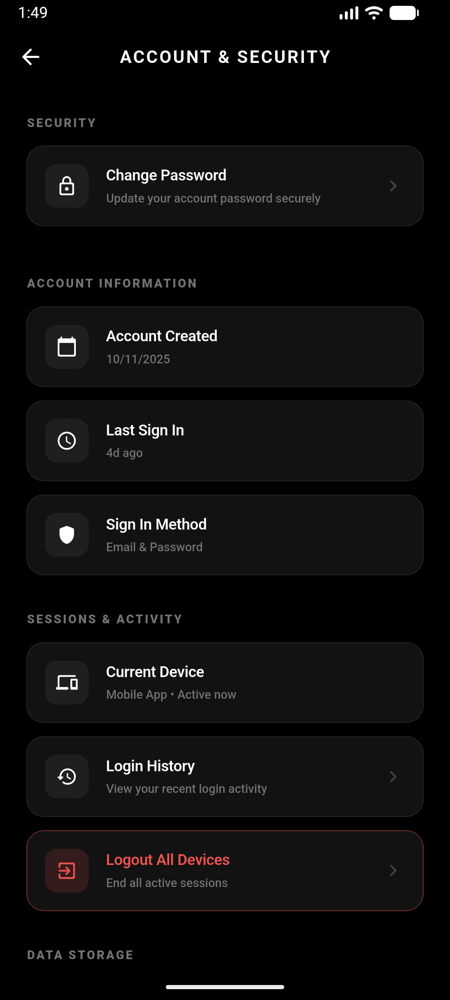 | 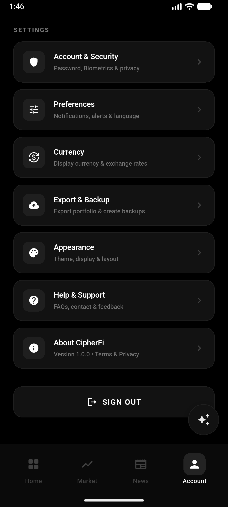 |

## What Makes CipherFi Different

- **Optimized AI Integration**: Utilizes efficient AI models for content summarization and intelligent categorization, designed for reliable performance on standard server hardware
- **Comprehensive Coverage**: Single platform for news, portfolio, and market data
- **Real-Time Intelligence**: Sub-second updates ensure you never miss critical market movements
- **User-Centric Design**: Intuitive interface focused on delivering actionable insights
- **Scalable Architecture**: Built to handle growing user bases and expanding data needs

## Key Benefits

- **Save Time**: AI-powered summaries turn hours of reading into minutes of insight
- **Stay Informed**: Never miss important market news or price movements with intelligent alerts
- **Make Better Decisions**: Access comprehensive portfolio analytics and historical data for informed investing
- **Learn Continuously**: Build your financial knowledge with our curated educational content
- **Peace of Mind**: Enterprise-grade security protects your data and investments

## Perfect For
- **Individual Investors**: Manage personal portfolios with professional-grade tools
- **Crypto Enthusiasts**: Stay informed about blockchain developments and market trends
- **Active Traders**: Get real-time alerts and data for informed trading decisions
- **Financial Learners**: Access educational content to build investment knowledge

CipherFi transforms complex financial information into actionable insights, giving you the competitive edge in today's fast-moving markets. Whether you're a seasoned investor or just starting your financial journey, CipherFi provides the intelligence and tools you need to make confident decisions.

**Ready to take control of your financial future? Start with CipherFi today.**
